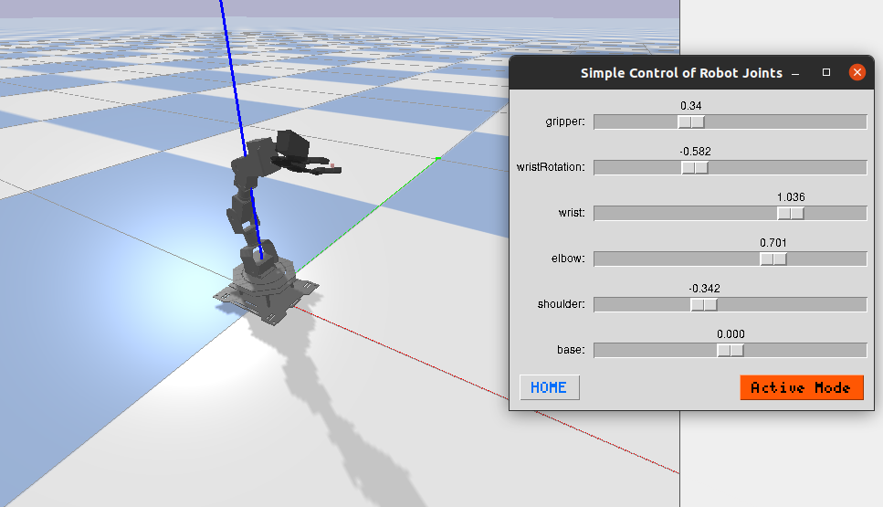
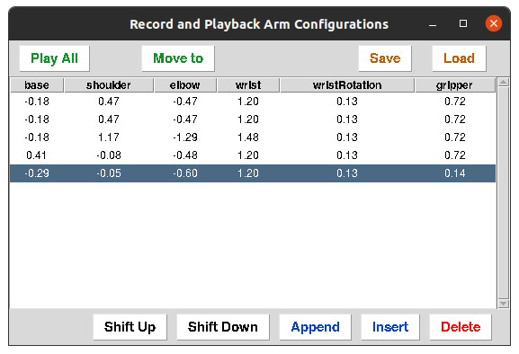

:github_url: https://github.com/dmklee/nuro-arm

Examples
===============

Interactive Windows
-------------------

Joint Angle Control
+++++++++++++++++++

The following terminal command will connect to the robot and generate a pop-up
window where you can control each motor in the robot.  There are two buttons
at the bottom: the one on the left moves the robot to the "HOME" position, the 
one on the right toggles the robot from active to passive mode.  When in passive
mode, the window will display the current joint positions (in radians) and you
are free to move the robot by hand.

.. code-block:: bash

    move_arm_with_gui

The image below shows the simulated robot along with the pop up window. If you
want to use the simulator, then use the command ``move_arm_with_gui --sim``.

Recording Trajectories
++++++++++++++++++++++

For designing arm trajectories, you can run the following command in the terminal

.. code-block:: bash

    record_movements

The robot will enter passive mode, allowing you to move it freely around. The 
pop up windows provide several buttons for creating and running through a sequence
of joint positions.  Hit "Play All" to move the robot through all rows of joint
positions, or hit "Move to" to move the robot to the highlighted row.  The robot
will return to passive mode after it has stopped executing the motions.  You
can save the sequences to be loaded and modified at another time using the "Save"
and "Load" buttons.

----------------------------------------------------------------------------

Python Scripts
--------------

Hardcoded Arm Movements
+++++++++++++++++++++++
create a sequence of arm joint positions and use for loop to go over them

.. code-block:: python

    from nuro_arm import RobotArm

    robot = RobotArm()
    jpos = [0, 0, 0, 0, 0]

    for i in range(10):
        jpos[1] += i/10
        robot.move_arm_jpos(jpos)

Using Feedback from Joint Positions
+++++++++++++++++++++++++++++++++++

Here is an example where we use the state of the gripper to determine whether an
object was grasped.  The program keeps attempting to close the gripper until it
detects an object in the gripper (i.e. gripper could not be fully closed), at
which point it drops the object off at another location.

.. code-block:: python

    from nuro_arm import RobotArm

    robot = RobotArm()
    grasp_jpos = [-0.2, 0, 0.5, 0, 0]
    drop_jpos = [0.2, 0, 0.5, 0, 0]

    robot.open_gripper()
    robot.move_arm_jpos(grasp_jpos)

    while True:
        robot.close_gripper()
        gripper_state = robot.get_gripper_state()

        # if something in gripper, drop it off
        if gripper_state > 0.1:
            robot.move_arm_jpos(drop_jpos)
            robot.open_gripper()
            break

        robot.open_gripper()

Top-Down Grasping
+++++++++++++++++
show IK solution example

Nudging a Cube
++++++++++++++
show cube detection and movement
