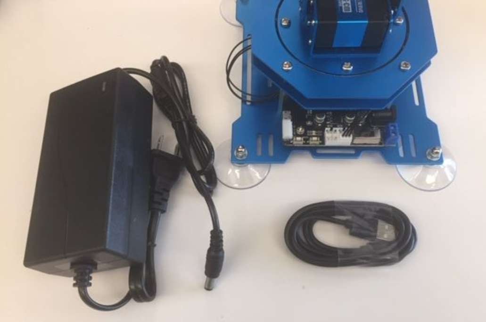
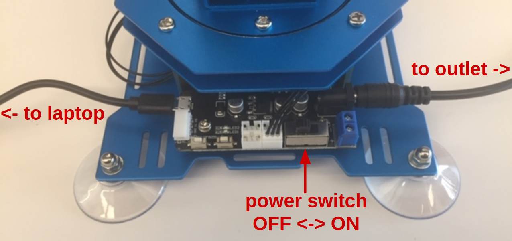

:github_url: https://github.com/dmklee/nuro-arm

Getting Started
===============

Installing Software
-------------------

Mac
+++

Install the repository using pip.

.. code-block:: bash

    pip install nuro-arm

Windows
+++++++

Coming soon...

Linux
+++++++

First, install the repository using pip.

.. code-block:: bash

    pip install nuro-arm

Then, install the following libraries which are needed to communicate with the 
robot over the USB connection.

.. code-block:: bash

    pip install nuro-arm

If you experience problems connecting to the robot, you may need to run the
following command (usually everytime you restart the machine).

.. code-block:: bash

    sudo service fwupd stop

-------------------------------------------------------------

Parts List
----------

.. list-table::
    :header-rows: 1
    
    * - Description
      - Price
    * - `Hiwonder xArm <https://www.amazon.com/LewanSoul-Programmable-Feedback-Parameter-Programming/dp/B0793PFGCY/ref=sr_1_3?dchild=1&keywords=lewansoul+xarm&qid=1618417178&sr=8-3>`_
      - $200
    * - `USB Camera <https://www.amazon.com/ELP-megapixel-Camera-Module-120degree/dp/B01DRJXDEA/ref=sr_1_1?crid=12SN0I987B5WH&dchild=1&keywords=elp+megapixel+super+mini+720p+usb+camera+module+with+120degree+lens&qid=1618417242&sprefix=elp+camera+megapix%2Caps%2C157&sr=8-1>`_
      - $32
    * - `Toy Cubes <https://www.amazon.com/ETA-hand2mind-1-inch-Color-Cubes/dp/B01J6GC83U/ref=sr_1_13?dchild=1&keywords=wooden+cubes+color&qid=1619112911&sr=8-13>`_
      - $20
    * - Camera Stand
      - $10

Assembly Instructions
---------------------
The assembly process takes about 2.5 hours and does not require any additional
 tools. The parts will all be located in the Hiwonder box. To assemble the
 robot, watch the following instructional videos provided by Hiwonder.

	#. `Assembly 01 <https://www.youtube.com/watch?v=68N5oQAYfEI>`_
	#. `Assembly 02 <https://www.youtube.com/watch?v=BhTdgkRTBoE>`_: self-tapping means the screws will have a pointy end.
	#. `Assembly 03 <https://www.youtube.com/watch?v=ij0365iMALk>`_: it may take some force to fit the blue parts over the servo horns;  the portion after 3:25 is about cable management and is optional. If any wires are sticking out too much, you might want to fasten them down to avoid them getting caught during motion.

The final step is to plug in the robot.  We must plug two things into the controller board on the robot: the power supply and the usb cable.  See the pictures below to understand how to plug things in.  If everything is correct, when you flip the power switch to ON, lights on the motors will turn on.  If you hear a beeping noise, this means the power supply is not plugged in.  Do not leave the robot on for extended periods of time, so make sure to flip the power switch when done.

.. _Calibration:

Calibration
-----------
The robot needs to be calibrated after assembly.  Initiate the calibration process with the following command, and you will be guided through the process with several popup windows.

.. code-block:: bash

    python -c "import nuro_arm; nuro_arm.calibrate_xarm()"

