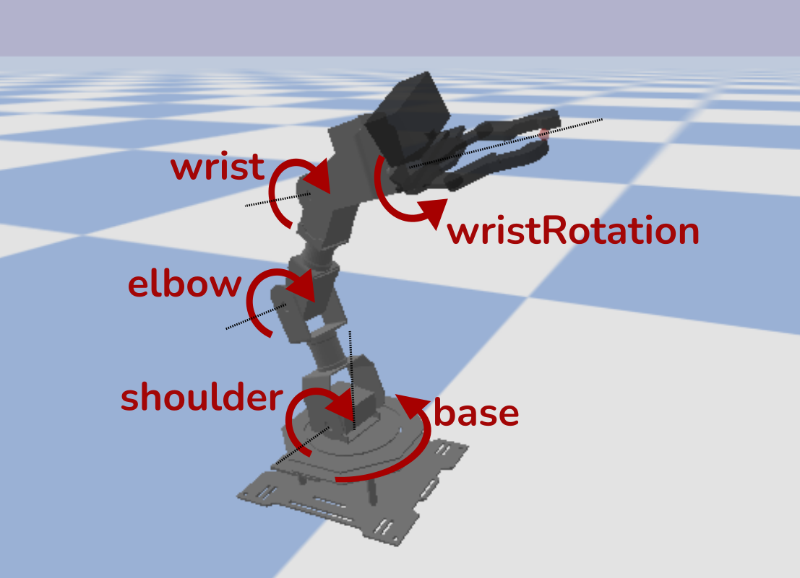
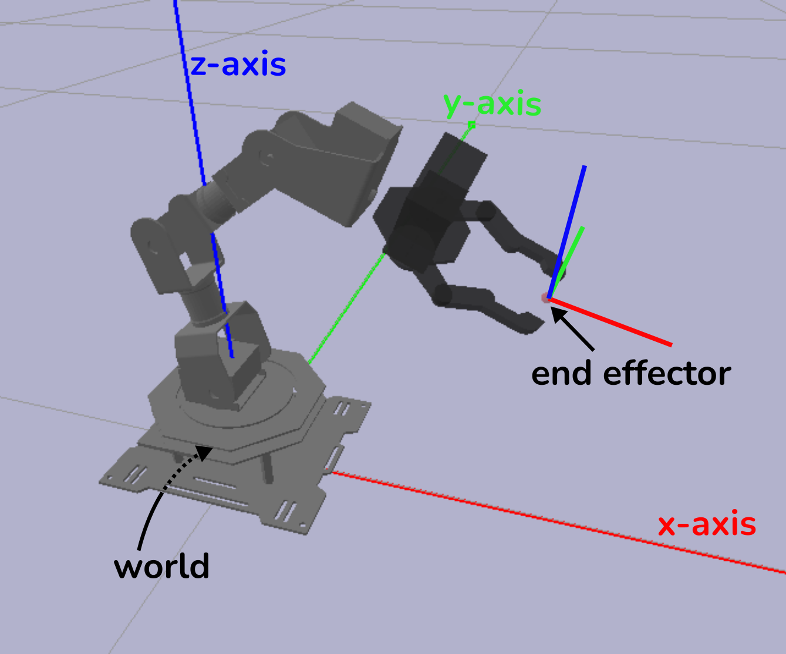

:github_url: https://github.com/dmklee/nuro-arm

Using Robot Arm
===============

Connecting to Robot
-------------------
Before connecting to the robot, turn it ON using the switch on the control board.  
If it makes a beeping noise, then you need to plug in the power cable.  Do **not** run 
the commands on this page unless you have already :ref:`calibrated the robot<Calibration>`.

.. code-block:: python
    
    from nuro_arm import RobotArm

    # connect to robot
    controller_type = 'real' # or 'sim'
    robot = RobotArm(controller_type)

    # turn off motors, useful for guiding robot by hand
    robot.passive_mode()

    # turn on motors
    robot.active_mode()

Joint Angle Control
-------------------
The simplest way to control the robot is to set the angle for each of the five joints in the arm. The names and directions of each joint are shown in the image below.  For instance, by increasing the angle of the elbow joint, then the robot's gripper is moved closer to the ground.  If all joint angles are set to 0, then the robot is in the HOME position (this is what you set during calibration).  The robot expects joint angles in radians.

If you want to gain more intuition about the joints of the robot, try running the script: `python nuro_arm/examples/move_arm_with_gui.py`, which allows you to move each joint with a slider.

Here is a brief example of how to set and read the joint angles of the robot using `RobotArm.move_arm_jpos` and `RobotArm.get_arm_jpos`.  The API refers to joint angles as joint positions (or jpos).

.. code-block:: python
    
    # joint angles in radians, from base to wrist_rotation
    jpos = [0.3, 0, 0, 0, 0]

    # sends command, returns once motion stops
    robot.move_arm_jpos(jpos)

    # see achieved joint angles
    achieved_jpos = robot.get_arm_jpos()

If you plan to read joint angles while you move the robot arm by hand (for instance, to *teach* the  robot a movement), then make sure to enter passive mode first.

End Effector Control
--------------------

For certain tasks, like picking up an object, it is useful to command the robot
to move its gripper to a specific location in the world.  This is called **end
effector** control.  The figure below illustrates the end effector of the robot
and how the position is defined.  For this robot, the end effector is located
at the point where the gripper fingers close (thus if an object is located at
`X`, then moving end effector to `X` allows grasping the object).  The position
of the end effector is defined in meters, relative to the **world** (e.g. the
ground underneath the center of the robot).  For reference, the end effector
position pictured here is about <x=0.15, y=0., z=0.08>.

Once the robot receives the desired end effector position, it performs a calculation, called `Inverse Kinematics <https://en.wikipedia.org/wiki/Inverse_kinematics>`_, to determine the joint angles that each motor should be set to.  Below, we have a simple example showing how to move the end effector to a position and read the current end effector position.

.. code-block:: python
    
    # end effector position, units in meters
    ee_pos = [0.2, 0.0, 0.1]

    # sends command, returns once motion stops
    robot.move_hand_to(ee_pos)

    # see achieved end effector position
    achieved_ee_pos, _ = robot.get_hand_pose()

Using Gripper
-------------

.. code-block:: python
    
    # opens gripper, returns once motion stops
    robot.open_gripper()

    # closes_gripper, returns once motion stops
    robot.open_gripper()

    # for more fine-grained gripper control, use float ranging from 
    # 0 (fully closed) to 1 (fully opened)
    robot.set_gripper_state(0.1)

    # get current gripper state (ranging from 0 to 1)
    gripper_state = robot.get_gripper_state()

Collision Detection
-------------------
Coming soon... 

Advanced Motions
----------------
Coming soon... 

Care and Maintenance
--------------------

- **Always** clear the area around the robot of any fragile objects before using it.
- Always turn off the robot when not in use.
- Do not run the robot for extended periods of time; if you want to stay connected while you debug, then place the robot in passive mode to prevent the motors from overheating.
- Check that there is no pinching or straining of the wires between motors.  This is especially important if you are performing fast motions.
- Do not move the motors by force.  If there is resistance to movement, the motors may be ON.  Either turn off the robot or place it in passive mode.
